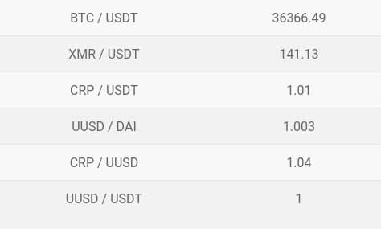

# uexchange-widgets
Widgets for sites with data from Crypton exchange



### How to start

```bash
cp config.example.json config.json
```

Set exchange pubkey & token in `config.json`

### Build & run

```go
go build
./widgets
```

The widget will be available at: `127.0.0.1:8080/pairs`
